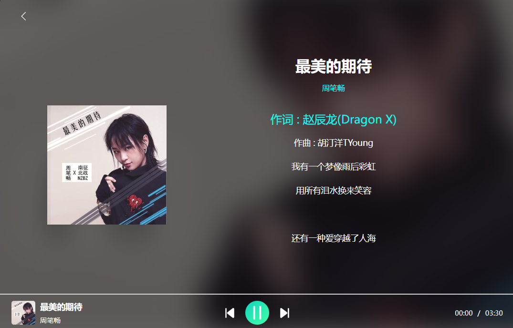
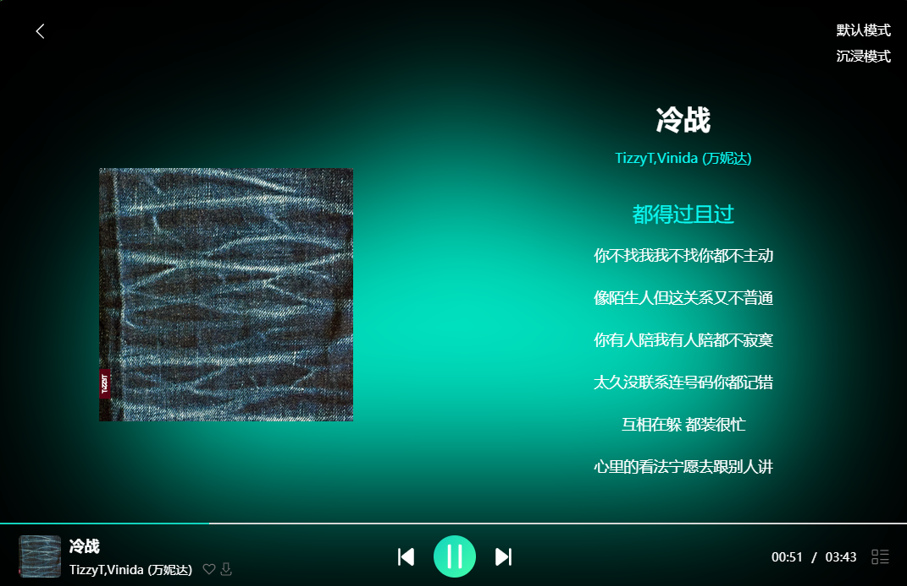
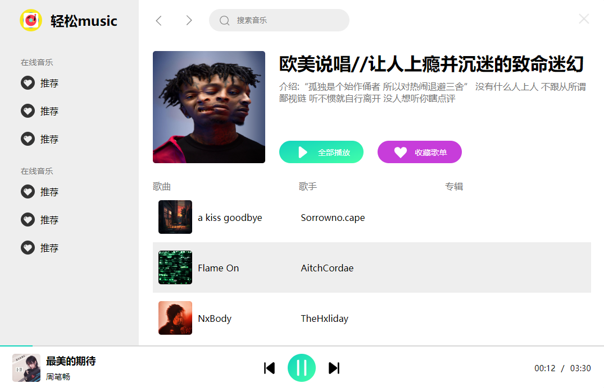
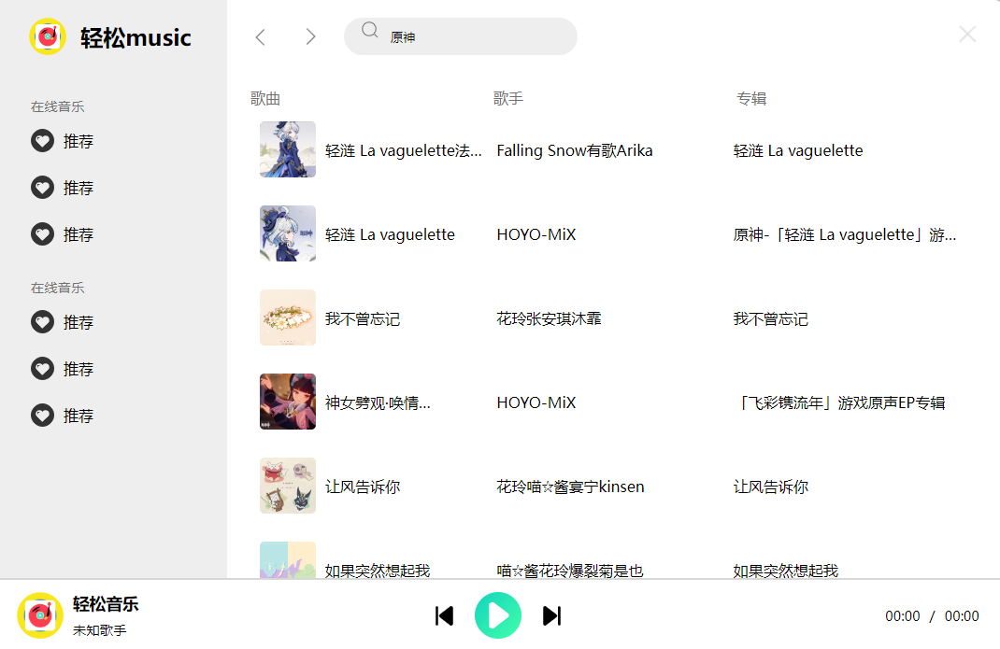

# 轻松音乐 v1.1.2

基于electron-vite+ vue 开发桌面端免费音乐软件替代方案

软件内所有内容均来源网络采集，请于下载后24小时内删除，

软件开发初衷是为了学习和研究，至停止维护之前不收费！

灵感来自：
[NeteaseCloudMusicApi](https://github.com/Binaryify/NeteaseCloudMusicApi)

### 预支持
| 功能          | 预计完成时间 | 状态    |
|-------------|--------|-------|
| 💖歌单        | 12月01日 | 已完成🟢 |
| 🎵沉浸弹幕评论    | 12月04日 | 已完成🟢 |
| 🎶沉浸式播放     | 12月04日 | 已完成🟢 |
| 🌏音质选择      | 12月15日 | 进行中🟡 |
| 🔴评论（查看，发表） | 12月10日 | 进行中🟡 |
| 📁登录        | --     | --    |
| 🎀同步歌单      | --     | --    |
| 🌏更多的播放器主题  | --     | --    |
|             |        |       |
|             |        |       |


### 开发初衷
方便自己听歌

### 安装教程
```
git clone https://gitee.com/tiankongskya/easy-music-vue-edition.git (gitee)
或者
git  clone https://github.com/2122940340/easy-music-vue-edition.git (github)
完成后
cd easy-music-vue-edition
```

**安装依赖** 
```bash
$ npm install
```

### 运行

```bash
$ npm run dev
```

### 打包

```bash
# windows
$ npm run build:win

# macOS
$ npm run build:mac

# Linux
$ npm run build:linux
```

### 图片介绍
主页

播放页

播放页(沉浸)

歌单

搜索

